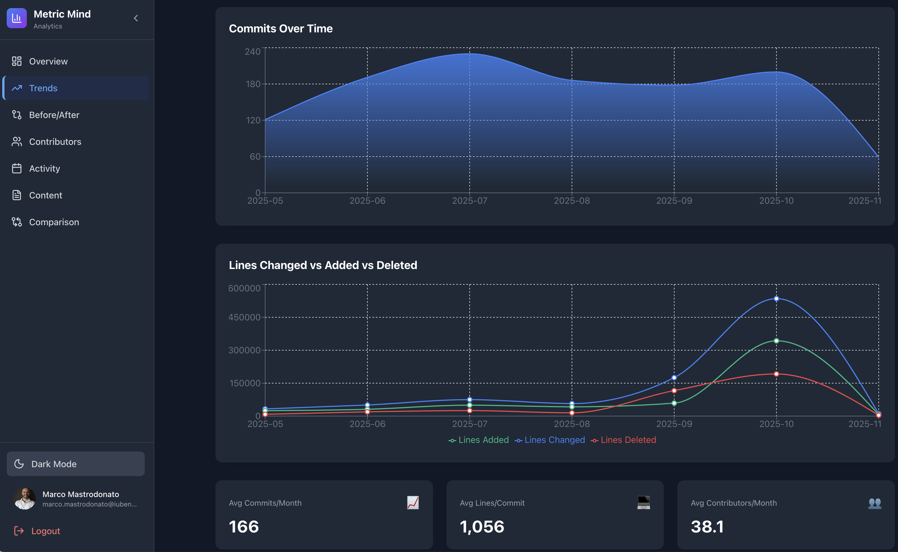

# Metric Mind Dashboard

An AI-driven developer productivity analytics system that extracts, stores, and visualizes git commit data from multiple repositories to measure the impact of development tools and practices.



## Overview

This system provides comprehensive analytics to answer questions like:
- How do commit patterns change over time?
- What's the impact of new AI tools on developer productivity?
- Which contributors are most active across projects?
- How do different repositories compare in terms of activity?

### Architecture

```
┌─────────────────┐
│ Git Repos       │
│ (Multiple)      │
└────────┬────────┘
         │
         ▼
┌─────────────────┐
│ Extract Script  │ ← git_extract_to_json.rb
│ (per repo)      │
└────────┬────────┘
         │
         ▼
┌─────────────────┐
│ JSON Files      │ ← Intermediate storage
│ (per repo)      │
└────────┬────────┘
         │
         ▼
┌─────────────────┐
│ Load Script     │ ← load_json_to_db.rb
└────────┬────────┘
         │
         ▼
┌─────────────────┐
│ PostgreSQL DB   │
│ ┌─────────────┐ │
│ │ Raw Commits │ │ ← Per-commit detail
│ └─────────────┘ │
│ ┌─────────────┐ │
│ │ Aggregations│ │ ← Views for queries
│ └─────────────┘ │
└────────┬────────┘
         │
         ▼
┌─────────────────┐
│ Dashboard       │ ← This project
│ (WIP)   │
└─────────────────┘
```

## Dashboard Specifications

### Purpose

The dashboard provides an intuitive, visually appealing interface to explore git productivity metrics and answer key questions:
- How is productivity trending over time?
- Who are the most active contributors?
- How do different repositories compare?
- What impact did tools or process changes have?

### Technology Stack

**Backend:**
- Node.js with Express
- PostgreSQL database connection
- RESTful API architecture
- CORS enabled for cross-origin requests
- Passport.js for Google OAuth2 authentication
- JWT for stateless session management
- Cookie-parser for secure httpOnly cookies

**Frontend:**
- React with Vite build tool
- React Router for navigation
- Recharts for data visualization
- Tailwind CSS for styling
- Axios for API requests

**Project Structure:**
```
git-analytics-dashboard/
├── server/                    # Backend API
│   ├── index.js              # Express server
│   ├── db.js                 # PostgreSQL connection & user queries
│   ├── config/
│   │   ├── env.js            # Environment variables loader
│   │   └── passport.js       # Passport Google OAuth2 strategy
│   ├── middleware/
│   │   └── auth.js           # Authentication middleware
│   ├── utils/
│   │   └── jwt.js            # JWT token utilities
│   └── routes/
│       ├── api.js            # API endpoints (protected)
│       └── auth.js           # Authentication endpoints
├── client/                    # React frontend
│   ├── src/
│   │   ├── main.jsx          # Entry point
│   │   ├── App.jsx           # Main app with AuthProvider
│   │   ├── components/       # Reusable components
│   │   │   ├── Avatar.jsx    # User avatar component
│   │   │   ├── Layout.jsx    # Navigation with auth
│   │   │   └── ProtectedRoute.jsx  # Route protection
│   │   ├── contexts/
│   │   │   └── AuthContext.jsx     # Auth state management
│   │   ├── pages/            # Dashboard views
│   │   │   ├── Login.jsx     # Google OAuth login page
│   │   │   ├── Unauthorized.jsx   # Access denied page
│   │   │   └── ...           # Dashboard pages
│   │   ├── utils/            # Helper functions
│   │   │   └── api.js        # API client with auth
│   │   └── styles/           # CSS files
│   ├── index.html
│   ├── vite.config.js        # Vite config with auth proxy
│   └── package.json
├── package.json               # Root package.json
├── .env                       # Environment variables
├── CLAUDE.md                  # Detailed project documentation
└── .replit                    # Replit configuration
```

### Commit Description Feature

The dashboard displays detailed commit descriptions throughout all commit lists. When a commit has an extended description (beyond the subject line), an interactive info icon (ⓘ) appears next to the commit message.

**How it works:**
- Info icon appears only when description is available
- Click the icon to view full description in a popup
- Popup automatically positions itself to stay within viewport
- Click outside or press the X button to close
- Supports multi-line descriptions (2-4 sentences)
- Full dark mode support

**Available in these pages:**
- **Overview** - "Commit Details" section (Top 10 Largest Commits)
- **Trends** - Month details panel (Top commits for selected month)
- **My Performance** - "Last X commits" section
- **Commit Search** - Search results table

### Dashboard Views

The dashboard includes the following pages:

**Public Pages:**
- **Login** (`/login`) - Google OAuth2 authentication with company branding
- **Unauthorized** (`/unauthorized`) - Access denied page for non-authorized email domains

**Protected Pages** (require authentication):

1. **Overview** (`/`)
   - Repository cards displaying all repositories with commit count, contributors, and latest commit date
   - Advanced filtering controls:
     - Repository selector (all or specific repository)
     - Date range selectors (from/to month)
     - Dynamic period display
   - Overall statistics cards with animated counters (7 key metrics):
     - Total commits, lines added, lines deleted, lines changed
     - Average lines changed/added/deleted per commit
   - Top 10 Largest Commits section:
     - Bar chart visualization showing lines changed per commit
     - Detailed table with commit date, hash, message, author, and repository
   - Top 10 Contributors section:
     - Horizontal bar chart showing commit counts by contributor
     - Detailed table with contributor stats including repos contributed and average lines per commit

2. **Trends** (`/trends`)
   - Monthly commit trends with smooth area charts
   - Lines changed vs added vs deleted visualization
   - Repository selector filter
   - Time range selector (3, 6, 12, 24 months)
   - Average metrics cards
   - **Interactive month selection** - Click on any month in the charts to view top 10 commits for that month
   - **Collapsible commit details panel** - Shows commit details including date, lines changed/added/deleted, message, hash, author, and repository
     - Hidden by default for full-width charts
     - Slides in from the right when a month is clicked
     - Close button (X icon) to hide panel and return to full-width view
     - Helper text below first chart guides users to click on a month
   - **Responsive layout** - Side panel on desktop (right), stacked below charts on mobile
   - **Real-time filtering** - Commit details automatically update when repository filter changes

3. **Contributors** (`/contributors`)
   - Top 3 podium visualization with medals
   - Horizontal bar chart
   - Detailed statistics table
   - Search functionality
   - Adjustable contributor count (10/20/50/100)

4. **Activity** (`/activity`)
  - **Purpose**: Track day-to-day commit patterns
  - **Key Components**:
    - Calendar heatmap showing commit activity (darker = more commits)
    - Timeline view showing recent commits
    - Activity distribution charts (by day of week, hour of day)
    - Repository filter to focus on specific projects
  - **User Experience**:
    - Quick identification of high/low activity periods
    - Visual patterns reveal work habits
    - Interactive filtering and date range selection
   - **User Experience**:
     - Quick identification of high/low activity periods
     - Visual patterns reveal work habits
     - Interactive filtering and date range selection

5. **Comparison** (`/comparison`)
  - **Purpose**: Compare repositories side-by-side
  - **Key Components**:
    - Side-by-side metrics cards for each repository
    - Multi-series bar chart comparing key metrics
    - Sortable table showing all comparison metrics
    - Percentage indicators showing relative activity
  - **User Experience**:
    - Easy identification of most/least active projects
    - Clear visual differentiation between repositories
    - Insights into resource allocation and project health

6. **Before/After Analysis** (`/before-after`)
  - **Purpose**: Measure impact of changes (new tools, processes, team changes)
  - **Key Components**:
    - Repository selector (specific repository or "All Repositories" for global analysis)
    - Date range pickers for "Before" and "After" periods
    - Quick-action buttons (→ 3/6/12 months) to auto-set After period dates
    - Split-screen comparison cards showing metrics side-by-side
    - Percentage change indicators (↑ ↓) with color coding
    - Visualization comparing the two periods
    - Automated insights section highlighting key changes
  - **Metrics to Compare**:
    - Average commits per month
    - Average lines changed per commit
    - Average contributors per month
    - Average commits per committer (productivity metric)
  - **User Experience**:
    - Clear visual separation of "before" vs "after"
    - Prominent percentage changes (green for improvement, red for decline)
    - Quick setup with preset time period buttons
    - Easy reconfiguration of time periods
    - Global comparison across all repositories or focused analysis on specific repo

7. **Content Analysis Page** (`content-analysis`)
  - **Purpose**: Understand **what** business domains developers are working on
  - **Key Components**:
    - Category breakdown (pie/donut chart showing distribution)
      - BILLING, CS, INFRA, etc.
      - Shows which business areas get most development attention
    - Category comparison (horizontal bar chart)
      - Compare effort across all categories
      - Easy identification of top/bottom categories
    - Trend charts over time
      - How category distribution changes month-to-month
      - Stacked area chart showing category evolution
    - Category by repository (matrix/heatmap)
      - Which repos work on which categories
      - Identify domain ownership patterns
    - Repository and date range filters
- **Insights Provided**:
  - Which business domains get most/least attention
  - Resource allocation across different work streams
  - Evolution of work focus over time
  - Domain ownership patterns across repositories
  - Neglected areas that may need attention
- **User Experience**:
  - Interactive charts with drill-down capability
  - Filter by repository, date range, and category
  - Export view for presentations/reports
  - Tooltip showing details on hover
  - Color-coding: Different color for each business domain
  - Percentage and absolute numbers displayed
- **Example Use Cases**:
  - "How much effort went into BILLING vs CS last quarter?"
  - "Are we neglecting infrastructure work?"
  - "Which categories need more resources?"
  - "How has our focus shifted after launching the new product?"
  - "Which repositories contribute to customer service improvements?"
- **Category Extraction Logic**:
  - Categories are automatically extracted from commit subjects using:
    1. Pipe delimiter: `BILLING | Implemented feature` → BILLING
    2. Square brackets: `[CS] Fixed bug` → CS
    3. First uppercase word: `BILLING Implemented feature` → BILLING
    4. If no match: NULL (shown as "UNCATEGORIZED" in UI)

8. **Commit Search Page** (`/commits`)
  - **Purpose**: Search and manage individual commits
  - **Key Components**:
    - Advanced search filters (Repository, Author, Date Range, Hash)
    - Interactive results table with sortable columns
    - **Weight Indicator**: Visual display of commit weight
    - **Description Display**: Info icon shows full commit description in popup
    - **Edit Modal**: Modify commit subject, category, weight, and AI tools
  - **Access Control**:
    - Edit functionality restricted to commit authors
  - **User Experience**:
    - Quickly find specific commits
    - View detailed commit descriptions with info icon
    - Correct metadata (categories, weights) directly from the UI
    - Track AI tool usage per commit

### Weight Analysis System (v1.1.0)

The dashboard includes a comprehensive weight analysis system that allows prioritization and accurate measurement of commit impact by accounting for reverted commits and low-weight work.

#### Weight Concepts

**Commit Weights (0-100):**
- **0**: Reverted commits (no lasting impact on codebase)
- **1-99**: Partially weighted commits (reduced impact, e.g., auto-generated code, refactoring)
- **100**: Full weight commits (normal, meaningful work)

#### Weight Metrics

The system calculates and displays several weight-related metrics:

- **Effective Commits**: Weighted commit count calculated as `SUM(commit_weight) / 100`
  - Example: 100 commits with 85% average weight = 85 effective commits
- **Average Weight**: Mean weight across all commits (0-100 scale)
- **Weight Efficiency**: Percentage of effective commits vs total commits
  - Formula: `(effective_commits / total_commits) × 100`
  - 100% = all commits have full weight
  - <100% = some commits are weighted down
- **Weighted Lines**: Line metrics (added/deleted/changed) adjusted by commit weight
  - Example: 357k lines at 50% weight = 178.5k weighted lines

#### Weight Visualization

**Gradual Disclosure UI Pattern:**
- Weight indicators only appear when efficiency < 100%
- Keeps the interface clean when all work has full weight
- Highlights anomalies and low-weight work when present

**WeightBadge Component:**
Color-coded badges with hover tooltips:
- 🟢 **Green (100%)**: Full weight - all commits counted
- 🟡 **Yellow (75-99%)**: Minor deductions - mostly full impact
- 🟠 **Orange (50-74%)**: Significant deductions - reduced impact
- 🔴 **Red (<50%)**: Heavy deductions - low impact

**Weight Impact Section (Content Analysis Page):**
- Overview cards showing overall weight efficiency
- Low weight categories table with detailed breakdown:
  - Category name and average weight
  - Total commits vs effective commits
  - Discounted commits (commits with reduced weight)
  - Visual weight efficiency indicators
- Repository weight efficiency comparison chart
- Only appears when weight efficiency < 100% or low weight categories exist

#### Weighted Data in Charts

**All charts display weighted metrics by default** to provide accurate productivity measurement:

- **Trends Page**: Line and area charts show `weighted_lines_changed`, `weighted_lines_added`, `weighted_lines_deleted`
  - Example: A commit with 357k lines at 50% weight appears as ~178k lines in the chart
- **Activity Page**: Calendar heatmap and timeline use weighted line counts
- **Comparison Page**: Bar charts compare repositories using weighted metrics
- **Contributors Page**: Tables show weighted lines changed and weight efficiency per contributor
- **Overview Page**: Statistics cards display both total and effective commits with weight badges

This ensures that:
- Reverted commits (weight=0) don't inflate productivity metrics
- Low-weight commits don't overshadow high-impact work
- Charts reflect actual business impact, not just volume of changes

#### How the Toggle Works

Users can switch between weighted and unweighted data visualization using the "Use Weighted Data" checkbox available on Trends, Activity, Comparison, and Contributors pages.

**Example: Repository with 10 commits at 50% average weight**

| Toggle State | Commits Display | Lines Display | Use Case |
|--------------|-----------------|---------------|----------|
| ✅ Use Weighted Data (default) | **5 effective commits** | **~50% of lines** | Accurate business impact measurement |
| ❌ Use Weighted Data (unchecked) | **10 total commits** | **100% of lines** | Raw activity comparison |

**Combined with "Per Committer" toggle (Trends page):**
- ✅ Per Committer + ✅ Weighted → Effective commits per committer
- ✅ Per Committer + ❌ Weighted → Total commits per committer
- ❌ Per Committer + ✅ Weighted → Total effective commits
- ❌ Per Committer + ❌ Weighted → Total commits (raw)

### API Endpoints

The backend exposes these RESTful endpoints:

#### Authentication (Public)
- **GET /auth/google** - Initiates Google OAuth2 flow
- **GET /auth/google/callback** - Google OAuth callback handler with domain validation
- **GET /auth/github** - Initiates GitHub OAuth2 flow
- **GET /auth/github/callback** - GitHub OAuth callback handler with domain validation
- **GET /auth/gitlab** - Initiates GitLab OAuth2 flow
- **GET /auth/gitlab/callback** - GitLab OAuth callback handler with domain validation
- **GET /auth/check** - Check authentication status and return user info
- **POST /auth/logout** - Logout user and clear JWT cookie

**Note:** All `/api/*` endpoints below require authentication (valid JWT token in cookie).

**Weight Analysis Fields (v1.1.0):**
Most endpoints now return additional weight-related fields when available:
- `effective_commits` - Weighted commit count (may be fractional)
- `avg_weight` - Average commit weight (0-100)
- `weight_efficiency_pct` - Weight efficiency percentage
- `weighted_lines_added/deleted/changed` - Line metrics adjusted by commit weight

These fields may be `undefined` or `null` in older data or when weights are not configured. Clients should handle these as optional fields with appropriate fallbacks.

#### Repository Management
- **GET /api/repos** - List all repositories with summary statistics
  - Returns: Repository ID, name, description, total commits, latest commit date, contributor count

#### Trends & Analytics
- **GET /api/monthly-trends** - Global monthly trends across all repositories
  - Returns: Aggregated monthly data for all repositories combined
  - Fields: month, total commits, total lines changed, unique authors, avg lines per commit

- **GET /api/monthly-trends/:repoName** - Monthly trends for a specific repository
  - Returns: Monthly statistics for the specified repository
  - Fields: month, commits, lines added/deleted, authors, averages per author

- **GET /api/monthly-commits/:year_month** - Top commits for a specific month
  - Param: `:year_month` - Month in YYYY-MM format (e.g., 2024-01)
  - Query params: `repo` (optional, filters by repository), `limit` (default: 10)
  - Returns: Top N commits for the specified month sorted by lines changed
  - Fields: commit_date, commit_hash, commit_message, author_name, repository_name, lines_changed, lines_added, lines_deleted
  - Use case: Display detailed commit information when users click on a month in charts

#### Contributors
- **GET /api/contributors** - Top contributors across all repositories
  - Query params: `limit` (default: 20)
  - Returns: Contributor name, email, total commits, repositories contributed to, lines changed
  - Sorted by: Total commits (descending)

#### Activity
- **GET /api/daily-activity** - Daily commit activity
  - Query params: `days` (default: 30)
  - Returns: Date, repository, commits, lines changed, unique authors

#### Comparison & Analysis
- **GET /api/compare-repos** - Compare all repositories side-by-side
  - Returns: Repository statistics for last 6 months
  - Fields: total commits, lines changed, months active, avg authors, avg lines per commit

- **GET /api/before-after/:repoName** - Compare two time periods for impact analysis
  - Param: `:repoName` - Repository name or "all" for aggregated analysis across all repositories
  - Query params: `beforeStart`, `beforeEnd`, `afterStart`, `afterEnd`
  - Returns: Average metrics for "before" and "after" periods
    - `avg_commits_per_month` - Average commits per month
    - `avg_lines_per_commit` - Average lines changed per commit
    - `avg_authors` - Average contributors per month
    - `avg_commits_per_committer` - Average commits per committer (productivity metric)
  - Use case: Measure impact of tools, processes, or team changes

#### Content Analytics (Categories & Work Types)
- **GET /api/categories** - Category statistics across all repositories
  - Returns: Category name, total commits, unique authors, repositories, lines changed
  - Sorted by: Total commits (descending)

- **GET /api/work-types** - Work type statistics across all repositories
  - Returns: Work type (feature, bugfix, hotfix, etc), commits, authors, lines changed
  - Sorted by: Total commits (descending)

- **GET /api/categories/:repoName** - Category breakdown for specific repository
  - Returns: Categories with commit counts and metrics for the repository

- **GET /api/category-trends** - Monthly trends by category
  - Query params: `months` (default: 12)
  - Returns: Month, category, commits, authors, lines changed
  - Shows how work is distributed across categories over time

- **GET /api/work-type-trends** - Monthly trends by work type
  - Query params: `months` (default: 12)
  - Returns: Month, work type, commits, authors, lines changed
  - Shows distribution of feature work vs bugfixes over time

- **GET /api/category-work-matrix** - Cross-tabulation of categories and work types
  - Returns: Matrix showing commits for each category+work_type combination
  - Use case: "How many BILLING features vs BILLING bugfixes?"

### Database Schema

**Core Tables:**
- `repositories` - Repository information
- `commits` - Individual commit records (includes subject, description, hash, date, author, lines changed, weight, category, etc.)
- `users` - Authenticated users (google_id, email, name, domain, avatar_url)

**Analytics Views:**
- `mv_monthly_stats_by_repo` - Pre-computed monthly statistics (materialized)
- `v_contributor_stats` - Aggregated contributor data
- `v_daily_stats_by_repo` - Daily activity aggregations
- `v_commit_details` - Detailed commit information with repository joins

Categorization creates these views:

- `v_category_stats` - Category statistics across all repos
- `v_work_type_stats` - Work type statistics
- `v_category_by_repo` - Category breakdown per repository (special tags in the title)
- `v_work_type_by_repo` - Work type breakdown per repository based on branch name
- `mv_monthly_category_stats` - Monthly category trends (materialized)
- `v_category_work_type_matrix` - Category + work type combinations
- `v_uncategorized_commits` - Commits needing categorization

### Database Migrations

The dashboard uses an **automated migration system** that manages database schema changes:

**Key Features:**
- ✅ **Automatic execution** on server startup (no manual intervention required)
- ✅ **Timestamp-based naming** (YYYYMMDDHHMMSS_description.sql) prevents conflicts
- ✅ **Rollback support** with `.down.sql` files
- ✅ **Shared migration tracking** with extractor project via `schema_migrations` table
- ✅ **Transaction safety** - all migrations wrapped in transactions
- ✅ **Fail-fast** - server won't start if migrations fail

**Migration Commands:**
```bash
# View migration status (applied and pending)
npm run migrate:status

# Apply pending migrations manually
npm run migrate

# Rollback last migration
npm run migrate:rollback

# Create new migration template
npm run migrate:create add_feature_name
```

**How It Works:**
1. Server checks for pending migrations on startup
2. Applies them in timestamp order
3. Records each in `schema_migrations` table
4. Logs results to console
5. Only then starts the HTTP server

**Example Server Startup:**
```
🔄 Running database migrations...
✓ Applied migration: 20241201120000_add_github_oauth_support.sql
✅ Applied 1 migration(s)
🚀 API server running on port 3000
```

**Creating New Migrations:**
```bash
# Generate migration files
npm run migrate:create add_user_preferences

# Edit the generated files
migrations/20250123093000_add_user_preferences.sql       # Up migration
migrations/20250123093000_add_user_preferences.down.sql  # Rollback

# Apply migration (or restart server for automatic apply)
npm run migrate
```

**Migration Best Practices:**
- Use `IF EXISTS` / `IF NOT EXISTS` for idempotent operations
- Always create both `.sql` and `.down.sql` files
- Test rollback before deploying: `npm run migrate:rollback`
- Dashboard migrations only touch `users` table (core schema managed by extractor)
- Never modify applied migrations - create new ones instead

For comprehensive migration documentation including architecture, troubleshooting, and advanced usage, see the **Database Migrations** section in [CLAUDE.md](./CLAUDE.md).

### Design Specifications

**Design Philosophy:**
- Minimalist & elegant Apple-inspired design
- Smooth 300ms transitions throughout
- Soft shadows and refined spacing
- Responsive mobile layout with hamburger menu
- Custom styled scrollbars

**Icon Library:**
- **lucide-react** - Consistent, scalable, and accessible iconography
- Modern SVG icons with built-in support for size and color customization
- Used throughout the application for navigation, actions, and visual indicators
- Installation: `npm install lucide-react`
- Import example: `import { TrendingUp, Users, Code } from 'lucide-react'`

**Color Palette:**
- **Primary Blue**: `#3b82f6` (buttons, accents)
- **Purple**: `#8b5cf6` (secondary stats, bars)
- **Green**: `#10b981` (success, positive metrics, additions)
- **Orange**: `#f59e0b` (warnings, highlights)
- **Red**: `#ef4444` (danger, deletions)
- **Background**: White / Gray-900 (dark mode)

**Animation Features:**
- Animated number counters (CountUp effect - 2s duration)
- Smooth chart transitions (1000ms)
- Stagger animations for lists (50ms delays)
- Hover scale effects on cards (105%)
- Fade-in animations for page loads

**Interactive Features:**
- Repository selector (all repos or specific)
- Time range selector (multiple options)
- Search bar for contributors
- Top N selector for leaderboard
- Dark mode toggle (persisted in localStorage)

### Authentication

**OAuth2 with Multiple Providers (Google, GitHub & GitLab)**

The dashboard requires authentication via OAuth2. Only users with email addresses from authorized domains can access the application. Users can sign in using Google, GitHub, or GitLab accounts, and all providers can be linked to the same account.

**Features:**
- Multiple OAuth2 providers (Google, GitHub, and GitLab)
- **Linked accounts**: Same email address can use all three providers to login
- Domain-based access control (@iubenda.com, @team.blue)
- JWT token authentication with httpOnly cookies
- User avatar display in header
- Automatic session management (7-day expiry)
- Secure logout functionality

**Required OAuth Environment Variables:**

*Google OAuth:*
- `GOOGLE_CLIENT_ID` - Google OAuth2 Client ID
- `GOOGLE_CLIENT_SECRET` - Google OAuth2 Client Secret
- `GOOGLE_CALLBACK_URL` - OAuth callback URL (e.g., http://localhost:3000/auth/google/callback)

*GitHub OAuth:*
- `GITHUB_CLIENT_ID` - GitHub OAuth App Client ID
- `GITHUB_CLIENT_SECRET` - GitHub OAuth App Client Secret
- `GITHUB_CALLBACK_URL` - OAuth callback URL (e.g., http://localhost:3000/auth/github/callback)

*GitLab OAuth:*
- `GITLAB_CLIENT_ID` - GitLab Application ID
- `GITLAB_CLIENT_SECRET` - GitLab Application Secret
- `GITLAB_CALLBACK_URL` - OAuth callback URL (e.g., http://localhost:3000/auth/gitlab/callback)
- `GITLAB_BASE_URL` - GitLab instance URL (default: https://gitlab.com, use custom URL for self-hosted GitLab)

*Common:*
- `JWT_SECRET` - Secret key for JWT signing (use `openssl rand -base64 32` to generate)
- `JWT_EXPIRES_IN` - JWT expiration time (default: 7d)
- `ALLOWED_DOMAINS` - Comma-separated list of allowed email domains
- `CLIENT_URL` - Frontend URL (default: http://localhost:5173)

**Setup Instructions:**

*Google OAuth:*
1. Create OAuth2 credentials in [Google Cloud Console](https://console.cloud.google.com/)
2. Enable Google+ API or People API
3. Add authorized redirect URIs (development and production)
4. Copy Client ID and Client Secret to `.env` file

*GitHub OAuth:*
1. Create OAuth App in [GitHub Developer Settings](https://github.com/settings/developers)
2. Set Homepage URL (e.g., http://localhost:5173)
3. Set Authorization callback URL (e.g., http://localhost:3000/auth/github/callback)
4. Copy Client ID and Client Secret to `.env` file
5. **Important:** Ensure your GitHub email is verified and set to public for domain validation

*GitLab OAuth:*
1. Create OAuth Application in [GitLab User Settings > Applications](https://gitlab.com/-/profile/applications)
   - For self-hosted GitLab: Navigate to User Settings > Applications on your GitLab instance
2. Fill in application details:
   - **Name:** Metric Mind Dashboard
   - **Redirect URI:** `http://localhost:3000/auth/gitlab/callback` (add production URL as well)
   - **Scopes:** Select `read_user` (to read user profile and email)
3. Save the application
4. Copy the **Application ID** and **Secret** to your `.env` file
5. **Optional:** If using self-hosted GitLab, set `GITLAB_BASE_URL` to your instance URL (e.g., https://gitlab.company.com)

*Database Migrations:*
- **Automatic Migration**: Migrations run automatically when the server starts
- **Manual Migration**: Run `npm run migrate` to apply pending migrations manually
- OAuth migrations already included:
  - `20241201120000_add_github_oauth_support.sql`
  - `20241215140000_add_gitlab_oauth_support.sql`
- These migrations add support for linked OAuth accounts (same email can login with all providers)
- See "Database Migrations" section below for details

For detailed authentication documentation, see [CLAUDE.md](./CLAUDE.md).

### Environment Requirements

**Database Configuration:**
- `PGHOST` - PostgreSQL host
- `PGPORT` - PostgreSQL port (default: 5432)
- `PGDATABASE` - Database name (default: git_analytics)
- `PGUSER` - Database user
- `PGPASSWORD` - Database password

**Server Configuration:**
- `PORT` - Backend server port (default: 3000)
- `NODE_ENV` - Environment (development/production)

### Deployment

The dashboard can be deployed on:
- **Replit**: Using `.replit` configuration
- **Local Development**: Using `npm run dev`
- **Production**: Using `npm run build` and `npm start`

Ports:
- Backend API: 3000
- Frontend Dev Server: 5173

## Testing

The project uses a comprehensive testing framework to ensure code quality and reliability:

### Testing Stack

- **Vitest**: Fast unit and integration testing for React components and utilities
- **React Testing Library**: Component testing with user-centric queries
- **Playwright**: End-to-end testing for complete user workflows
- **Happy DOM**: Lightweight DOM implementation for fast test execution

### Running Tests

**Unit Tests (Vitest):**
```bash
# Run all unit tests
npm run test

# Run tests in watch mode (re-runs on file changes)
npm run test:watch

# Run tests with coverage report
npm run test:coverage

# Run tests in UI mode (interactive)
npm run test:ui
```

**E2E Tests (Playwright):**
```bash
# IMPORTANT: Start dev server first in a separate terminal
npm run dev

# Then run E2E tests in another terminal
npm run test:e2e

# Run E2E tests in headed mode (see browser)
npm run test:e2e:headed

# Run E2E tests in UI mode (interactive debugger)
npm run test:e2e:ui
```

**Note:** For detailed testing guide, examples, troubleshooting, and best practices, see [TESTING.md](./TESTING.md).

### Test Structure

Tests are organized alongside the code they test:

```
client/src/
├── components/
│   ├── StatCard.jsx
│   └── StatCard.test.jsx          # Component tests
├── utils/
│   ├── dateFormat.js
│   ├── dateFormat.test.js         # Utility tests
│   └── api.test.js                # API client tests
├── test/
│   ├── setup.js                   # Test configuration
│   └── testUtils.jsx              # Shared test utilities
└── e2e/
    ├── overview.spec.js           # E2E user workflow tests
    ├── trends.spec.js
    └── contributors.spec.js
```

### Writing Tests

**Unit Tests Example:**

```javascript
import { describe, it, expect } from 'vitest';
import { formatDate } from './dateFormat';

describe('formatDate', () => {
  it('should format Date object to dd/mm/yyyy', () => {
    const date = new Date('2024-12-25');
    expect(formatDate(date)).toBe('25/12/2024');
  });
});
```

**Component Tests Example:**

```javascript
import { describe, it, expect } from 'vitest';
import { render, screen } from '@testing-library/react';
import StatCard from './StatCard';

describe('StatCard', () => {
  it('should render title and value', () => {
    render(<StatCard title="Total Commits" value={1234} icon="📊" />);
    expect(screen.getByText('Total Commits')).toBeInTheDocument();
  });
});
```

**E2E Tests Example:**

```javascript
import { test, expect } from '@playwright/test';

test('should navigate to trends page and filter data', async ({ page }) => {
  await page.goto('http://localhost:5173');
  await page.click('text=Trends');
  await expect(page).toHaveURL(/.*trends/);
  await page.selectOption('[data-testid="repo-selector"]', 'test-repo');
  await expect(page.locator('.chart-container')).toBeVisible();
});
```

### Test Coverage

The testing suite covers:

- **Utility Functions**: Date formatting, API client functions
- **React Components**: StatCard, LoadingSpinner, Layout components
- **User Workflows**: Navigation, filtering, data visualization interactions
- **API Integration**: Mocked API responses and error handling
- **Dark Mode**: localStorage persistence and theme switching

Run `npm run test:coverage` to generate a detailed coverage report in `client/coverage/`.

### Continuous Integration

Tests run automatically on:
- Pre-commit hooks (unit tests only)
- Pull request creation/update (full test suite)
- Main branch merges (full test suite + E2E)

## Version Management

The dashboard follows [Semantic Versioning](https://semver.org/spec/v2.0.0.html) (MAJOR.MINOR.PATCH):
- **MAJOR**: Breaking changes or significant architectural updates
- **MINOR**: New features or significant enhancements
- **PATCH**: Bug fixes and minor improvements

**Current Version:** `1.7.0` (displayed in footer on all pages)

### How to Update the Version

1. **Update version in `package.json`:**
   ```bash
   npm version patch   # For bug fixes (1.0.0 → 1.0.1)
   npm version minor   # For new features (1.0.0 → 1.1.0)
   npm version major   # For breaking changes (1.0.0 → 2.0.0)
   ```

2. **Update `CHANGELOG.md`:**
   - Add a new section at the top with the new version number and date
   - Document changes under appropriate categories:
     - **Added**: New features
     - **Changed**: Changes to existing functionality
     - **Fixed**: Bug fixes
     - **Removed**: Removed features

3. **Commit the changes:**
   ```bash
   git add package.json CHANGELOG.md
   git commit -m "v1.0.1 Release notes here"
   git tag v1.0.1
   git push && git push --tags
   ```

4. **Version automatically appears in UI:**
   - The version is injected at build time via Vite
   - No additional code changes needed
   - Users will see the new version in the footer after deployment

**Example CHANGELOG Entry:**
```markdown
## [1.0.1] - 2025-11-19

### Fixed
- Fixed date picker bug in Before/After analysis
- Resolved dark mode inconsistency on Contributors page

### Changed
- Improved chart loading performance on Trends page
```

For full version history, see [CHANGELOG.md](./CHANGELOG.md).

### Future Enhancements

- Real-time updates with WebSockets
- Export functionality (PDF, CSV)
- URL parameter sharing for Before/After analysis results
- Custom date range presets
- Multi-factor authentication (MFA) support
- Role-based access control (RBAC)
- Notification system for milestone achievements
- Improve commit classification using AI 

## Roadmap

TBD

## Contributing

This is an internal tool. For questions or suggestions, contact the development team.

## License

Internal use only.
